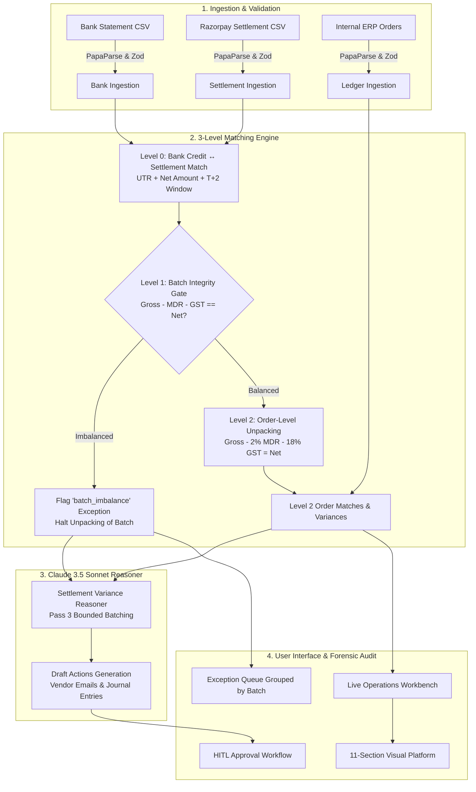

# ReconcileAI — Autonomous Bank & Ledger Reconciliation Engine

An intelligent AI Financial Intelligence & Reconciliation Platform that solves the **N-to-1 Razorpay Settlement Unpacking Problem** — converting lumped bank NEFT/RTGS settlement credits into constituent order matches, isolating 2% MDR gateway fees, claiming 18% GST Input Tax Credits (ITC), enforcing mathematical batch integrity gates, and conducting forensic Claude 3.5 Sonnet audits with Human-in-the-Loop (HITL) remediation.

Built for enterprise fintech reconciliation workflows.

---

## 🌟 Interactive Visual Platform Architecture

The frontend is structured into an **11-section interactive technical platform** designed for visual storytelling, forensic inspection, and active workbench operations:

| Section | Title | Description |
|---|---|---|
| **01** | **Overview & Live Telemetry** | High-level platform value proposition with real-time operational status metrics. |
| **02** | **How ReconcileAI Works** | 8-stage interactive pipeline (`Input → Parse → Normalize → L0 → L1 → L2 → AI → Audit`). |
| **03** | **Master Reconciliation Flow** | Centerpiece interactive flowchart with animated data streams and click-to-inspect nodes. |
| **04** | **3-Tier Matching Engine** | Interactive decision tree (Level 0 Nodal ➔ Level 1 Batch Integrity ➔ Level 2 Order Unpack) + live MDR & GST simulator. |
| **05** | **Multi-Pass Processing** | Heuristic timeline comparing Pass 1 Exact, Pass 2 Fuzzy, Pass 3 Claude AI Reasoner, and Final Posting. |
| **06** | **Data Transformation** | Transaction metamorphosis through 4 stages: Raw Ingested Row, Normalized Entity, Candidate Window, Reconciled Output. |
| **07** | **Exception & Fallback Flow** | Failure lifecycle triage desk embedding the active Exception Queue and HITL Draft Actions approval desk. |
| **08** | **Reconciliation Results** | Active workbench embedding 4 priority metric cards, live execution stepper, and console telemetry. |
| **09** | **System Architecture** | Full-stack topology graph (`Web Client → API Layer → 3-Tier Engine → Claude AI Reasoner → MongoDB Atlas & Audit Log`). |
| **10** | **System Verification** | Engineering verification dashboard showcasing **31 / 31 Tests Passed (100%)** test suite and verified subsystem categories. |
| **11** | **Final System Map** | Unified executive architecture blueprint summarizing the entire system end-to-end. |

---

## 🏗️ 3-Level Razorpay Settlement Unpacking Engine

---

## ⚡ Verified Benchmark Performance

On an enterprise 500-record benchmark dataset:
- **Level 0 (Bank ↔ Batch Match)**: **94.1%** (16 / 17 bank credits matched via UTR & net amount).
- **Level 1 (Batch Integrity Gate)**: **15 batches balanced**, exactly **1 batch imbalance** intercepted and quarantined before cascading.
- **Level 2 (Order Unpacking)**: **86.8% matched orders** (422 / 486 constituent orders matched to internal ledger).
- **Gateway & Tax Intelligence**: Automatically calculated **₹1,82,280.10** in MDR fees and **₹32,810.47** in claimable GST Input Tax Credit.
- **Test Suite**: **31 / 31 tests passing (100%)** across 26 test suites.

---

## 🛠️ Tech Stack

- **Frontend**: React 18, Vite, Tailwind CSS, Framer Motion, Lucide Icons.
- **Backend**: Node.js (ES Modules), Express, Mongoose, Socket.io, PapaParse, Zod.
- **AI / LLM**: Anthropic Claude 3.5 Sonnet (`@anthropic-ai/sdk`), structured JSON schema output with single-repair retry loop.
- **Database**: MongoDB Atlas with append-only immutable SHA-256 chained audit trail.
- **Deployment**: Vercel Serverless Functions + Vite SPA.

---

## ⚖️ License
MIT License. Copyright (c) 2026 Karan Pareek.

