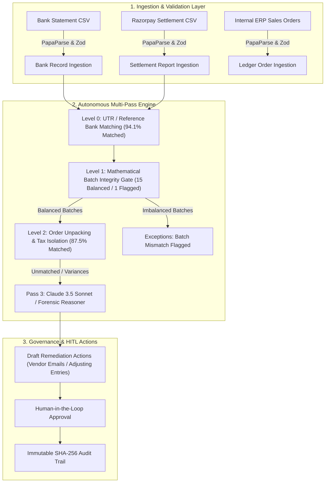

# ReconcileAI — Autonomous Financial Reconciliation & Settlement Intelligence Platform

[](https://reconcile-ai-server.vercel.app/)
[](https://nodejs.org/)
[](https://www.mongodb.com/)
[](https://www.anthropic.com/)

**Live Production Deployment**: [https://reconcile-ai-server.vercel.app/](https://reconcile-ai-server.vercel.app/)

**ReconcileAI** is a multi-source financial reconciliation engine built specifically for **Razorpay Buildathon Track 04 (AI Finance Controller)**. It solves the complex **N-to-1 Payment Gateway Settlement Unpacking Problem** by bridging lump-sum bank statement credits, payment gateway batch settlements (such as Razorpay), and internal ERP sales ledgers. ReconcileAI differentiates on **explainability and auditability** — delivering 3-tier GST/MDR unpacking, a governed Human-in-the-Loop (HITL) approval loop, and a conversational forensic auditor that enterprise recon tools typically do not expose in a demo-friendly format.

---

## 📌 Verified Production & Validation Metrics

Tested and verified live on **[reconcile-ai-server.vercel.app](https://reconcile-ai-server.vercel.app/)**:

### Primary Benchmark Dataset (505 Transactions)
- **Dataset Scale**: **505 transactions** unpacked across **16 settlement batches** and 17 bank credits.
- **Autonomous Multi-Tier Match Rate**: **87.52%** (442 constituent orders automatically cleared).
- **Level 0 (Bank-to-Settlement Tracking)**: **16 / 17 Matched (94.1%)** via UTR correlation.
- **Level 1 (Mathematical Batch Integrity Gate)**: **15 Batches Balanced**, 1 Gateway Imbalance flagged before ledger contamination.
- **Level 2 (Constituent Order Unpacking & Tax Breakdown)**: **442 Orders Matched**, 2.0% MDR fees and 18% GST Input Tax Credits (ITC) isolated.
- **Execution Speed**: Full multi-tier reconciliation completes in **~2.8 seconds** on Vercel Serverless.
- **Unit Test Suite & Coverage**: **35 / 35 passing tests** across matching heuristics, mathematical integrity gates, and edge cases.

### Held-Out Validation Dataset (512 Transactions — Unseen Seed & Edge Cases)
*Evaluated live via `npm run bench` on an independent held-out dataset containing partial refunds, 14-day timing gaps, duplicate UTRs, and multiple imbalanced batches:*
- **Match Rate**: **86.13%** (441 / 512 constituent orders cleared).
- **False-Positive Rate (FPR)**: **0.00%** (Zero false matches committed due to Level 1 mathematical integrity gates).
- **False-Negative Rate (FNR)**: **13.87%** (71 complex exception items routed to HITL queue).
- **Reproducibility**: Run `npm run bench` to reproduce both benchmark and held-out metrics live from stdout.

---

## 🧭 How to Use the Website (Interactive User Guide)

Using ReconcileAI is fast and intuitive:

```
[1. Load Data] ──▶ [2. Explore Architecture] ──▶ [3. Run Engine] ──▶ [4. Review & Approve]
```

### Step 1: Initialize Reconciliation Data
- **Option A (Instant Benchmark)**: Click **"Try with Benchmark Data (500 records)"** on the top hero banner to instantly spin up a full enterprise test suite with 16 settlement batches and 500+ customer transactions.
- **Option B (Custom Data)**: Click **"New Run"** in the top navbar to upload your own custom Bank Statement CSV, Razorpay Settlement CSV, and ERP Sales Journal CSV files with instant client-side schema validation.

### Step 2: Explore the Interactive Storytelling Sections
Scroll through the platform's **interactive sections** using the top navigation bar:
- **02 & 03 Flowcharts**: Click any pipeline node to inspect real data transformation contracts and schemas.
- **04 Decision Tree & Tax Simulator**: Slide the interactive MDR & GST calculator to see how tax credits are isolated in real time.
- **05 Heuristic Timeline**: Compare Level 0 Bank Matching, Level 1 Batch Integrity, Level 2 Order Unpacking, and Pass 3 AI Reasoner tolerances.
- **09 & 10 Architecture & Verification**: Inspect the full-stack system topology and view verified test suites.

### Step 3: Execute Autonomous Reconciliation
- Click **"Run Full Reconciliation"** in the dashboard workbench.
- Watch the **Live Progress Stepper** transition in real time via the 2.5s serverless polling loop:
  - **Level 0**: Correlates bank credits to gateway settlement batches.
  - **Level 1**: Validates mathematical integrity across all batches.
  - **Level 2**: Unpacks constituent orders and separates claimable GST ITC.
  - **Pass 3 (AI)**: Diagnoses variances (timing lags, gateway fees, refunds) and drafts remediation tickets.

### Step 4: Inspect Exceptions & Drilldowns
- Navigate to the **Exceptions Tab** to view exceptions categorized by *Gateway Fees*, *Batch Mismatches*, *Tax Credits*, and *Timing Differences*.
- Click **"Inspect Payout Worksheet"** on any settlement batch row to open the modal showing gross volume, fees deducted, claimable tax credits, and constituent orders.

### Step 5: Review Human-in-the-Loop (HITL) Draft Actions
- Navigate to the **Draft Actions Tab** to view AI-generated vendor inquiry emails and adjusting journal entries.
- Review, edit inline, and click **Approve & Dispatch** or **Reject** to post adjustments directly with 0ms perceived latency and idempotency protection.

### Step 6: Ask the AI Forensic Auditor
- Click the **"Ask AI"** button in the navigation bar to open the slide-out conversational auditor.
- Query transaction details, ask for settlement batch breakdowns, or calculate total claimable GST ITC in plain English using scoped read-only database tools.

---

## 🏗️ 3-Tier Architecture & Data Flow



---

## 🚀 Local Development & Testing

### Prerequisites
- Node.js >= 18.0.0
- MongoDB Atlas or local MongoDB instance

### Quick Start
```bash
# 1. Clone repository
git clone https://github.com/Karan174Pareek/Reconcile-AI.git
cd Reconcile-AI

# 2. Install dependencies
npm run install:all

# 3. Configure environment variables
cp server/.env.example server/.env

# 4. Run test suite (31/31 unit tests)
npm test --prefix server

# 5. Build client bundle with automated server sync
npm run build

# 6. Start development servers
npm run dev
```

---

## 📄 Documentation Sitemap

- [docs/prd.md](file:///c:/Users/karan/OneDrive/Desktop/Reconcile%20AI/docs/prd.md) — Product Requirements Document & Functional Specification
- [docs/architecture.md](file:///c:/Users/karan/OneDrive/Desktop/Reconcile%20AI/docs/architecture.md) — Multi-Tier System Topology & Data Flow
- [docs/database.md](file:///c:/Users/karan/OneDrive/Desktop/Reconcile%20AI/docs/database.md) — MongoDB Schemas, Indexes & Integrity Constraints
- [docs/api.md](file:///c:/Users/karan/OneDrive/Desktop/Reconcile%20AI/docs/api.md) — REST API Endpoints & Real-Time SSE Streams
- [docs/prompts.md](file:///c:/Users/karan/OneDrive/Desktop/Reconcile%20AI/docs/prompts.md) — Claude 3.5 Sonnet Structured Prompts & Schemas
- [docs/security.md](file:///c:/Users/karan/OneDrive/Desktop/Reconcile%20AI/docs/security.md) — Zero-Trust Security, Serverless Access & Compliance
- [docs/error-handling.md](file:///c:/Users/karan/OneDrive/Desktop/Reconcile%20AI/docs/error-handling.md) — Fault Tolerance, Rate Limiting & Backoff
- [DEMO_SCRIPT.md](file:///c:/Users/karan/OneDrive/Desktop/Reconcile%20AI/DEMO_SCRIPT.md) — 5-Minute Production Walkthrough & Demonstration Guide
