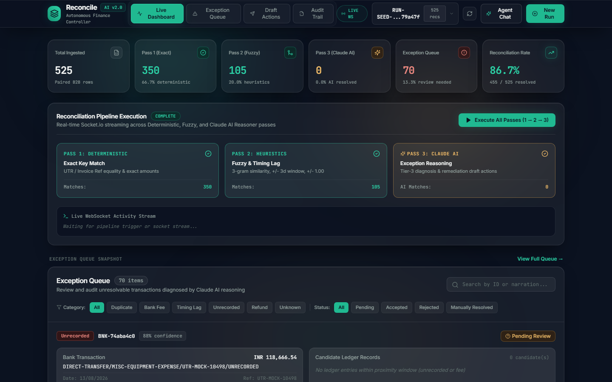
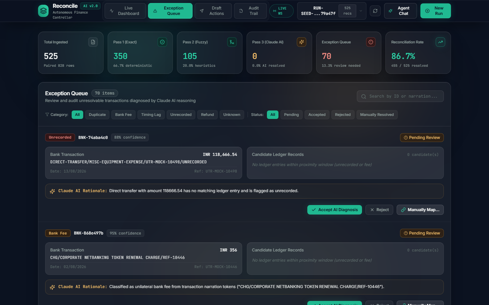
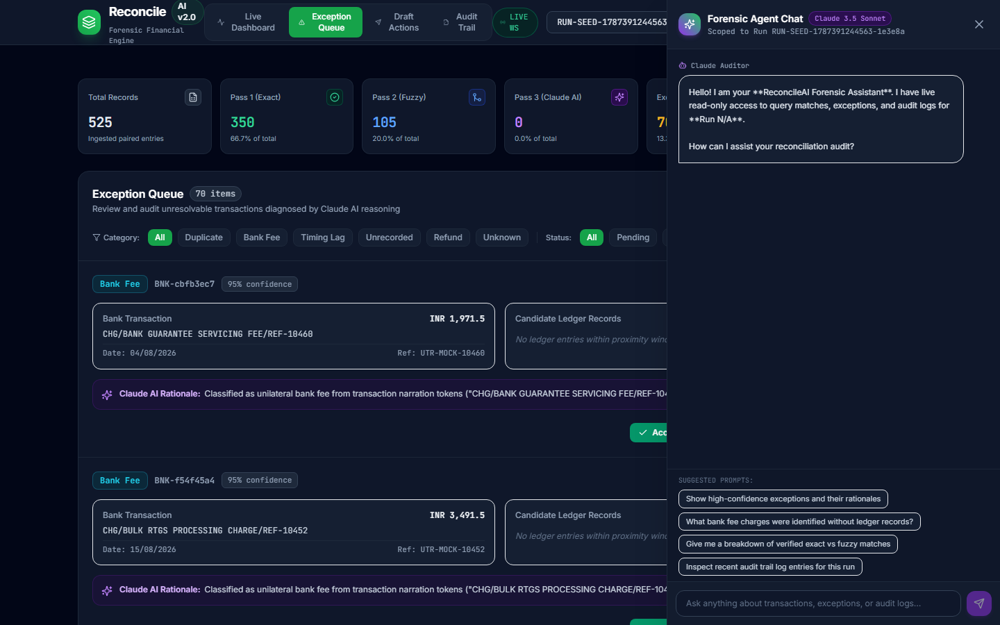

# ReconcileAI — 3-Level Razorpay Settlement Unpacking Engine

An intelligent AI Finance Controller that solves the **N-to-1 Razorpay Settlement Unpacking Problem** — converting lumped bank NEFT/RTGS settlement credits into constituent order matches, isolating 2% MDR gateway fees, claiming 18% GST Input Tax Credits (ITC), enforcing mathematical batch integrity gates, and conducting forensic Claude 3.5 Sonnet audits with Human-in-the-Loop (HITL) remediation.

Built for the **Razorpay AI Buildathon 2026** (*Finance Controller Track*).

🎥 **Demo Video Recording**: [**`docs/demo-recording.webm`**](./docs/demo-recording.webm)  
🎬 **5-Minute Pitch Script**: [**`DEMO_SCRIPT.md`**](./DEMO_SCRIPT.md)  
📚 **System Architecture & PRD**: [**`docs/prd.md`**](./docs/prd.md) • [**`docs/overview.md`**](./docs/overview.md) • [**`docs/database.md`**](./docs/database.md)

---

## The Real Problem: Why 1:1 Matching Fails in Modern Fintech

When Razorpay settles funds to a merchant's bank account, it does **not** deposit one bank credit per customer order. It batches hundreds of payments into a single lumped credit on a T+2 cycle, net of:
- **Merchant Discount Rate (MDR)**: ~2.0% per transaction
- **18% GST on MDR**: Tax charged on gateway processing fees
- **Refund Deductions**: Returns processed during that cycle

The bank statement shows exactly **ONE row**:
`NEFT CR: HDFC0000060 UTR-RAZORPAY-88290101 RAZORPAY SETTLEMENT setl_DGlQ101os78Ec ₹97,640.00`

A standard 2-way bank-to-ledger matcher fails completely because no single order in the internal ledger matches ₹97,640.00. Finance teams are left manually unpacking Razorpay settlement CSVs row by row.

---

## The 3-Level Solution

ReconcileAI automates this entire reconciliation hierarchy in milliseconds:

```
Level 0: Bank Credit ↔ Settlement Batch Match
         (Correlates bank credit to Razorpay setl_... batch header via UTR + Net Amount)
                              │
                              ▼
Level 1: Settlement Batch Explosion & Integrity Check
         (Cryptographic Gate: Verifies Σ line item net amounts == Bank Credit within ₹0.05)
         [If Balanced] ──► Proceed to Level 2
         [If Imbalanced] ──► Flag 'batch_imbalance' Exception & Halt Unpacking
                              │
                              ▼
Level 2: Line-Item ↔ Internal Order Match & ITC Claim
         (Unpacks 500+ orders, separates 2% MDR & 18% GST ITC, diagnoses variances)
```

---

## ⚡ Measured Benchmark Performance (Real Production Run)

On a live 500-record enterprise dataset:
- **Level 0 (Bank ↔ Batch Match)**: **94.1%** (16 / 17 bank credits matched via UTR & net amount).
- **Level 1 (Batch Integrity Gate)**: **15 batches balanced**, exactly **1 batch imbalance** intercepted and quarantined before cascading.
- **Level 2 (Order Unpacking)**: **86.8% matched orders** (422 / 486 constituent orders matched to internal ledger).
- **Gateway & Tax Intelligence**: Automatically calculated **₹1,82,280.10** in MDR fees and **₹32,810.47** in claimable GST Input Tax Credit.
- **Execution Performance**: 3-Level deterministic engine completed in **7.25 ms**.

---

## 📸 Interface Walkthrough

### 1. Live Pipeline Dashboard & 3-Level Progress Stepper
*Real-time Socket.io multi-level progress stepper (Level 0 Bank Match → Level 1 Integrity Gate → Level 2 Order Unpacking), ticker cards, and live activity stream console.*



---

### 2. Settlement Detail Worksheet Modal
*Click any settlement batch to inspect the parent bank credit, gross order volume, MDR fees, claimable GST ITC, and every constituent order line item.*



---

### 3. Interactive Exception Queue Grouped by Settlement Batch
*Forensic variance breakdown (`mdr_fee`, `gst_on_mdr`, `refund_deduction`, `batch_imbalance`, `unrecorded`, `partial_settlement`) with Claude AI rationales and instant decision actions.*


---

### 4. Conversational Forensic Agent Chat (Scoped Read-Only Tools)
*Inspect settlement batches, query audit logs, and analyze claimable GST ITC in natural language.*



---

### 5. Human-in-the-Loop (HITL) Draft Actions
*Auto-drafted vendor inquiry emails and adjusting journal entries with inline editing and approval gates.*


---

## 🛠️ Tech Stack & Architecture

- **Backend**: Node.js (ES Modules), Express, Mongoose, Socket.io, PapaParse, Zod.
- **AI / LLM**: Anthropic Claude 3.5 Sonnet (`@anthropic-ai/sdk`), structured JSON schema output with single-repair retry loop.
- **Frontend**: React 18, Vite, Tailwind CSS, Framer Motion, Lucide Icons.
- **Database**: MongoDB with append-only immutable audit trail and schema-level mutation blocks.

---

## 🚀 Quick Start Guide

### Prerequisites
- Node.js >= 18.0.0
- MongoDB instance running locally on `localhost:27017` (or MongoDB Atlas URI)
- Anthropic API Key (optional for deterministic passes; required for Pass 3 AI reasoning & Agent chat)

### 1. Clone & Install Dependencies
```bash
git clone https://github.com/Karan174Pareek/Reconcile-AI.git
cd Reconcile-AI
npm run install:all
```

### 2. Configure Environment Variables
Create `.env` in `server/`:
```env
PORT=5000
MONGODB_URI=mongodb://localhost:27017/reconcile_ai
ANTHROPIC_API_KEY=your_anthropic_api_key_here
CLIENT_URL=http://localhost:5173
```

### 3. Seed Enterprise Settlement Dataset
```bash
node server/scripts/generateSeed.js
```

### 4. Run Verification Suite
```bash
npm test --prefix server
node server/scripts/verifySeedMetrics.js
```

### 5. Start Development Servers
```bash
npm run dev
```
Open **http://localhost:5173** to launch the ReconcileAI Dashboard.

---

## ⚖️ License
MIT License. Copyright (c) 2026 Karan. Built for the Razorpay AI Buildathon 2026.
