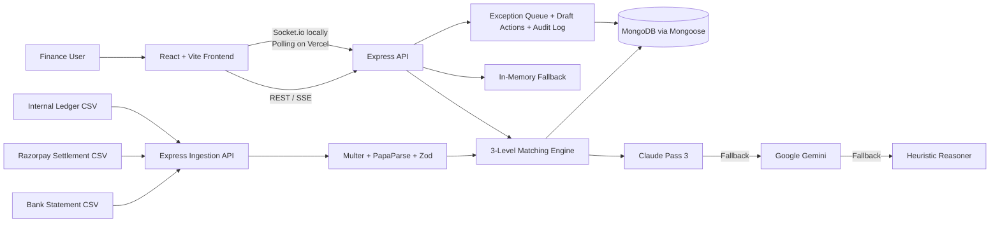

# ReconcileAI

Settlement reconciliation for Razorpay-style payout data: unpack bulk bank credits into order-level matches, fees, GST, refunds, and reviewable exceptions.

## Overview

Payment gateways commonly settle many orders as one bank credit. That makes it difficult for finance teams to connect bank activity to internal orders, explain MDR/GST deductions, and identify refunds or missing records.

ReconcileAI ingests bank statements, Razorpay settlement reports, settlement line items, and internal ledger data. Its three-level pipeline correlates the batch, verifies settlement arithmetic, and matches each order line to the ledger. Unresolved cases are categorized for human review and can be analyzed through a grounded AI assistant.

The project is useful for finance operations, controllers, and developers evaluating automated reconciliation workflows for payment-gateway settlements.

## Key Features

- Three-level reconciliation: bank credit to settlement, batch integrity, and order-level unpacking.
- Exact and controlled fuzzy matching with UTR, amount, date, and reference checks.
- Explicit variance categories for MDR, GST on MDR, refunds, rounding, partial settlements, unrecorded orders, and unknown cases.
- Claude-powered Pass 3 reasoning with Gemini and deterministic heuristic fallbacks, labeled by engine.
- Human-in-the-loop exception resolution and idempotent draft-action approval/rejection.
- Append-only audit logging and read-only, run-scoped agent tools.
- CSV journal and reconciliation-certificate exports, plus live progress through Socket.io locally and polling on Vercel.

## Architecture



- **Frontend:** dashboard, exception queue, settlement worksheet, draft-action queue, audit trail, and Ask AI drawer.
- **Ingestion API:** accepts CSV uploads in memory and validates rows before persistence.
- **Matching engine:** runs Level 0, Level 1, and Level 2 reconciliation with bounded processing.
- **AI services:** reason over unresolved settlement cases and fall back when a provider is unavailable.
- **MongoDB / memory fallback:** stores runs, records, matches, exceptions, draft actions, and audit events.
- **Vercel entrypoints:** serve the React build and expose the Express app as a serverless API.

## Razorpay Integration

This submission uses Razorpay settlement concepts and data structures, but does **not** make live Razorpay API calls.

- **Input represented:** settlement reports contain `settlement_id`, UTR, net amount, gross amount, fees, tax, refunds, and settlement date. Line items contain payment/order references and net settlement values.
- **Current source:** uploaded CSV files and the built-in synthetic benchmark generator in `server/scripts/generateSeed.js`.
- **Reconciliation:** Level 0 links a bank credit to a settlement batch using UTR, amount, and date proximity. Level 1 checks that line-item net amounts balance the stated settlement. Level 2 maps line items to internal ledger orders and separates MDR, GST, refunds, and other variances.
- **Not implemented:** Razorpay Checkout, live Orders/Payments/Settlements API calls, webhook ingestion, webhook signature verification, and payment capture/refund flows.
- **Security boundary:** no Razorpay credentials are required for the current CSV-based flow. AI and database credentials remain server-side and are configured through environment variables.

## Tech Stack

| Layer | Technology |
| --- | --- |
| Frontend | React 18, Vite, Tailwind CSS, Framer Motion |
| Backend | Node.js 18+, Express |
| Database | MongoDB, Mongoose; in-memory fallback for demos/serverless cold starts |
| Payments | Razorpay settlement data model and CSV fixtures; no live API integration |
| AI reasoning | Anthropic Claude SDK, Google Gemini REST fallback, deterministic heuristic engine |
| Authentication | JWT, bcryptjs |
| Validation and ingestion | Multer, PapaParse, Zod |
| Realtime | Socket.io locally; REST polling on Vercel |
| Deployment | Vercel |

## Project Structure

```text
Reconcile-AI/
├── client/
│   ├── src/                 React application and UI components
│   ├── api/                 Vercel serverless API entrypoint
│   └── server/              Synced backend copy used by the client deployment
├── server/
│   ├── app.js               Express application
│   ├── server.js            Local HTTP + Socket.io server
│   ├── controllers/         Ingestion, matching, chat, exceptions, exports
│   ├── services/            Matching engine, AI orchestration, memory store
│   ├── models/              Mongoose schemas
│   ├── routes/              REST route definitions
│   ├── scripts/             Seed generation and benchmark utilities
│   ├── data/                CSV fixtures and generated settlement data
│   └── tests/               Node test suite
├── api/                     Root Vercel API entrypoints
├── docs/                    Architecture, API, database, and security notes
├── scripts/syncServer.js    Keeps client/server synchronized with server/
├── package.json
└── README.md
```

## Getting Started

### Prerequisites

- Node.js 18 or newer
- npm
- MongoDB, optional for local demo mode and required for durable persistence
- Anthropic and/or Gemini API keys, optional; the heuristic fallback runs without them

### Installation

```bash
git clone <repository-url>
cd Reconcile-AI
npm install
```

### Environment Variables

Create `server/.env` from `server/.env.example`:

```env
PORT=5000
NODE_ENV=development
CLIENT_URL=http://localhost:5173

# Optional for durable persistence; omit to use the in-memory fallback
MONGO_URI=mongodb://localhost:27017/reconcile_ai

# Optional AI providers
ANTHROPIC_API_KEY=
ANTHROPIC_MODEL=claude-3-5-sonnet-20241022
GEMINI_API_KEY=
GEMINI_MODEL=gemini-3.5-flash-lite

# Set a strong value outside local development
JWT_SECRET=
```

`CLAUDE_API_KEY` and `CLAUDE_MODEL` are also accepted aliases for the Anthropic settings.

### Run Locally

Start the backend and frontend together:

```bash
npm run dev
```

Or run them separately:

```bash
npm run dev:server
npm run dev:client
```

The frontend runs at `http://localhost:5173` and the API at `http://localhost:5000`.

To seed MongoDB and write benchmark CSV fixtures (`MONGO_URI` required):

```bash
npm run seed:csv
```

The application can also generate benchmark data from the Overview screen or via `POST /api/runs/generate-seed`.

## Payment Flow

There is no live payment or checkout flow in this version. The implemented reconciliation flow is:

1. Upload bank, Razorpay settlement, and ledger CSV data, or generate the synthetic benchmark dataset.
2. Validate rows and store the run data.
3. Correlate bank credits with settlement batches using UTR, amount, and date.
4. Block imbalanced batches at the integrity gate.
5. Unpack balanced batches into order-level matches and calculate MDR, GST, refunds, and variances.
6. Escalate unresolved records to Claude, Gemini, or the heuristic reasoner.
7. Present exceptions and draft actions for human review, with audit events for decisions.

## Security

- CSV uploads are restricted to CSV files, held in memory, size-limited, and validated with Zod.
- JWT authentication and bcrypt password hashing are implemented for the auth flow.
- AI keys, database URIs, and signing secrets are read from server-side environment variables.
- Agent tools are read-only and scope database queries to the active `run_id`.
- AuditLog mutation and deletion operations are rejected by Mongoose middleware.
- Draft actions require explicit human approval and approval/rejection is idempotent.

## Demo

- Live demo: [reconcile-ai-server.vercel.app](https://reconcile-ai-server.vercel.app/)
- No demo credentials or video link are included in the repository.
- Use the built-in benchmark generator to evaluate the end-to-end workflow without external payment credentials.
