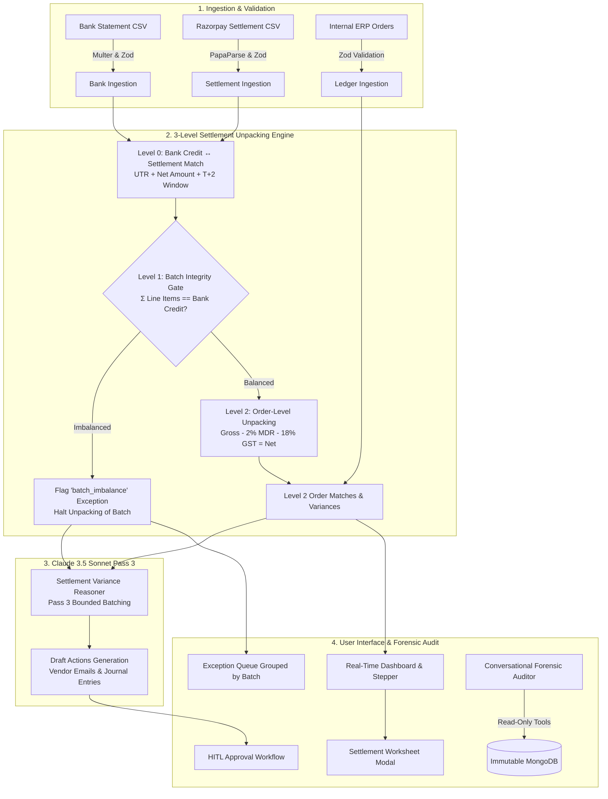

# ReconcileAI — System Architecture

## Security & Data Isolation
1. **Read-Only Agent Tools**: Claude Agent Chat runs through `agentToolRouter.js` with strictly scoped queries (`query_settlements`, `get_settlement_detail`, `query_matches`, `query_exceptions`, `query_audit_log`).
2. **Immutable Audit Trail**: Audit records in MongoDB have schema-level mutation blocks preventing `updateOne`, `updateMany`, `deleteOne`, and `deleteMany`.
3. **No Fabricated Data**: If a batch does not mathematically balance, the integrity gate halts processing rather than estimating numbers.
